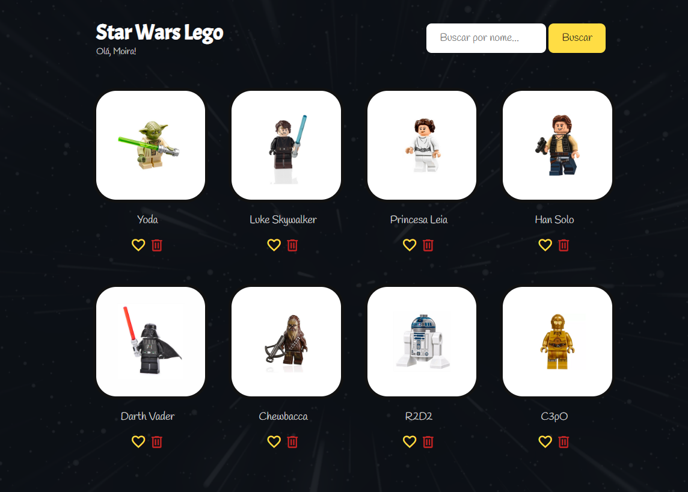

<h1 align="center">Star Wars Lego</h1>

## 💻 Sobre o projeto

Durante o curso **Introdução a programação básica em Javascript** oferecido pela **QAXperience**, desenvolvi uma WebApp com o framework vue.js, implementando funcionalidades com tudo que foi passado ao longo do curso.
 
Neste curso, obtive habilidades básicas em programação em Javascript e familiaridade com HTML e CSS, entendendo sobre variáveis, constantes, funções, arrays, objetos, loops, operadores e controles de fluxo.

## 🛠 Tecnologias

As seguintes tecnologias foram usadas na construção do projeto:
 
     

## 🎨 Layout
O layout da aplicação desenvolvida:

  

 ## 📝 Licença

Este projeto esta sobe a [MIT License](./LICENSE.md).

Feito com ❤️ por Moira Abile 👋🏽 [Entre em contato!](https://br.linkedin.com/in/moira-luiza-abile-93526816a)
